# Data-driven Analysis of NBA Draft Adages
---
Canzhi Ye, Shashank Bhargava

## Introduction
---
Nothing defines the success of a team in the NBA quite like the NBA draft; the draft represents the one time a year where a team is solely responsible for the talent that comes their way. Other options of talent acquisition, like trades and free agency, depend on external conditions: location, salary cap, relationships between players, the list goes on. However, the draft is what separates the great teams from the pack, and allows for sustained success beyond just one generation of players is consistent and successful drafting.

The NBA draft occurs once a year, in June. By default, each team gets one draft pick in each of the two rounds, and the order is determined essentially by ranking the teams from worst to best. 

Every year, the draft is met with much fanfare, as teams try to project the future careers of teenagers. To properly categorize these players, a lot of pundits rely on commonly held adages to describe how players project. A lot of these adages remain in the public eye, even after it seems like they make no sense. For example, many people are under the impression that skinnier big men lack the ability to play inside and properly post up. While this fact can be debated, the game of basketball has gone through a transition such that these skills no longer seem as important as they once did. The emergence of the stretch 4, a power forward who plays on the outside and is able to stretch the court by shooting instead of necessarily posting up, has made it seem like this adage might no longer have a place in the modern day NBA. Thus, our project has a very simple goal: look through these adages that present themselves and see if advanced metrics show whether they hold or not.

More specifically, here are the adages we explored:

- The Spurs consistently draft players who exceed their expectations
- Big men who are too skinny as prospects are more likely to fail
- Big men have shorter careers

## Data
---
The data for this experiment was collected from two main sources: draft data and season data collected from Basketball Reference and NBA combine data collected from the official NBA website. The draft data includes how a player performed throughout their career, while the NBA combine data includes measurable data such as height, weight, body fat percentage, wingspan, and standing reach. 
Our analysis was done using iPython, numpy and the UC Berkeley data science library. Plots were made with matplotlib and using the FiveThirtyEight style guide for graphing. These technologies allow us to be able to analyze the data relatively easily and visualize it in a way that allows for easy interpretation. 


## Draft Adage \#1
### The Spurs consistently draft players who exceed their expectation
---
The Spurs have been perennial championship contenders since the turn of the century. In the last 16 seasons, they have won at least 50 games. In five of those seasons, they were NBA champions. What is their secret to success? The predominant narrative claims that the Spurs employ a superior talent evaluation and draft strategy.


A key component to any analysis of draft adages is to quantify how good each pick turns out to be. 


How do we measure how good a player is? There are two main metrics that I will use throughout the rest of this analysis, Win Shares and Value Over Replacement Player. 


#### `Win Shares`
Win Shares splits a team's success and attributes it to its individual players. Roughly speaking, the sum of the win shares for each player on a team equals the total number of wins for that team. Throughout the analysis, we standardize this statistic by actually using win shares per 48 minutes (length of an NBA game). For context, the all-time leader in win shares per 48 minutes is Michael Jordan. We will abbreviate this stat as WS/48. 


#### `Value Over Replacement Player`
Value Over Replacement Player (VORP) is another statistic that holistically measures how good a player is. It is fundamentally a box score-based metric, meaning that it is derived from the numbers in the final box score for each game. (Box scores typically include shots attempted, shots made, rebounds, assists, steals, blocks, and turnovers.) Certain weights are applied to each stat to measure an individual's contribution to the team, which is then compared to the contribution of a hypothetical "replacement player." The commonly accepted definition for replacement player is one who is either on minimum salary or not a normal member of a team's rotation. Much debate has occurred over the years about how to exactly calculate this. The details in calculating VORP are not something considered in this analysis of NBA Draft adages.


(Definitions from Basketball Reference.)

Below is what the "value profile" of a player looks like. It's useful to define these cryptic abbreviations.

- WS: Win Shares (as defined above)


- WS/48: Win Shares per 48 minutes (length of an NBA game)


- WS/48 sum: Sum of WS/48 over a draft year. This can be used to measure the relative strength of a draft class. Drafting a good but not great player in a very strong draft class is not quite as impressive as drafting a good player in a very weak draft class. The latter scenario demonstrates a team's ability to evaluate talent.


- WS/48 %: The percentage of a class' WS/48 that a player contributes. This controls for strength of draft class.


- WS/48_z: Standard units/z-score for a player's WS/48 compared to all players drafted since 1991. 


- WS/48_z mean: Mean standard units/z-score for a player's WS/48 compared to all players drafted with the same pick number since 1991. For example, #1 overall picks have a WS/48\_z mean of 0.809, which means that the average #1 overall pick had a WS/48\_z of 0.809.


- WS/48\_z_expected: The expected standard units/z-score for a player's WS/48 compared to all players drafted with the same pick number since 1991. This is based not on the mean, but on a fourth-degree polynomial fit of the means.


- WS/48\_z\_ae: A player's WS/48\_z minus WS/48\_z_expected for the pick that the player was drafted at. This stat measures how much better than expected a player is, compared to other player's drafted with that pick in other drafts.


- VORP: Defined above. 


- VORP sum: Same as WS/48 sum, except with VORP instead of WS.


- VORP %: Same as WS/48 %, except with VORP instead of WS.


- VORP_z: Same as WS/48\_z, except with VORP instead of WS.


- VORP_z mean: Same as WS/48\_z mean, except with VORP instead of WS.


- VORP\_z\_expected: Same as WS/48\_z_expected, except with VORP instead of WS.


- VORP\_z_ae: Same as WS/48\_z\_ae, except with VORP instead of WS.


- Career status: Categorical data based on VORP\_z_ae. Players are split up into five bins, bust, bad, met, exceeded, and far exceeded, which describes a player's career performance relative to their expectations based on their draft position.


<table border="1" class="dataframe">
    <thead>
        <tr>
            <th>Pk</th> <th>Year</th> <th>Player</th> <th>Tm</th> <th>WS/48</th> <th>WS/48 sum</th> <th>VORP</th> <th>VORP sum</th> <th>WS</th> <th>WS/48_%</th> <th>VORP_%</th> <th>WS/48_z</th> <th>VORP_z</th> <th>WS/48_z mean</th> <th>VORP_z mean</th> <th>WS/48_z_expected</th> <th>VORP_z_expected</th> <th>WS/48_z_ae</th> <th>VORP_z_ae</th> <th>Career Status</th> <th>Spurs</th>
        </tr>
    </thead>
    <tbody>
        <tr>
            <td>1   </td> <td>1997</td> <td>Tim Duncan       </td> <td>SAS </td> <td>0.209</td> <td>3.109    </td> <td>89.3</td> <td>229.8   </td> <td>206.4</td> <td>0.0672242</td> <td>0.388599  </td> <td>1.64245  </td> <td>8.36264   </td> <td>0.80917     </td> <td>2.02866    </td> <td>0.591069        </td> <td>1.39221        </td> <td>1.05138   </td> <td>6.97044   </td> <td>Exceeded     </td> <td>True </td>
        </tr>
    </tbody>
</table>


## How well are draft picks expected to perform?


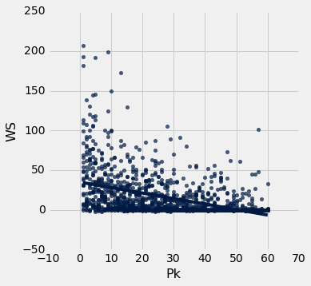


The above scatter plot shows a clear correlation between a player's draft position (x-axis) and their normalized WS/48, although the data does seem to be noisy across all draft picks. This indicates that perhaps career performance is not linear relative to draft position.


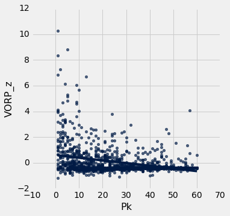


The above scatter plot is like the previous, except it usesh VORP instead of WS/48. Once again, it seems abundantly clear that career performance is not linear relative to draft position, rather it's polynomial or exponential.


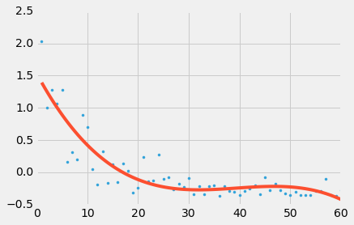


The above graph uses a polynomial regression to fit the scatter plot of VORP\_z\_mean vs draft pick. This line of best fit defines what is expected of a player for the purpose of the following analysis. We notice that players drafted in the second round are hardly expected to be different from each other.

### Spurs' Draft Picks


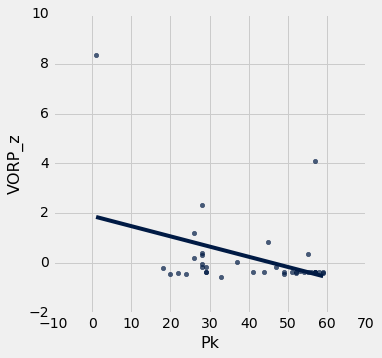


The above plot shows only the Spurs' draft selections from 1991 through 2011. We don't evaluate data past 2011 because many draft picks don't contribute at their potential for around the first five years in the league. Notice that the Spurs rarely pick near the top of the draft. This is because the order of the draft is roughly the reverse order of the previous season's standings. 


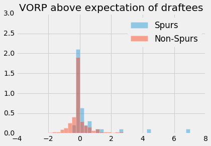


It's quite interesting to see that the Spurs have drafted a larger proportion of players who did not meet their expectations based on their draft pick as seen in the above histogram. At the same time, the right tail indicates that the Spurs drafted a larger proportion of players who exceeded or far exceeded their expectation.

<table border="1" class="dataframe">
    <thead>
        <tr>
            <th>Career Status</th> <th>Spurs</th> <th>Non-Spurs</th>
        </tr>
    </thead>
    <tbody>
        <tr>
            <td>Bad          </td> <td>0.0526316</td> <td>0.0816327</td>
        </tr>
    </tbody>
        <tr>
            <td>Bust         </td> <td>0        </td> <td>0.0238095</td>
        </tr>
    </tbody>
        <tr>
            <td>Exceeded     </td> <td>0.342105 </td> <td>0.140306 </td>
        </tr>
    </tbody>
        <tr>
            <td>Far Exceeded </td> <td>0.0263158</td> <td>0.0042517</td>
        </tr>
    </tbody>
        <tr>
            <td>Met          </td> <td>0.578947 </td> <td>0.75     </td>
        </tr>
    </tbody>
</table>


We created a contingency table with five different Career Status categories that were defined when pre-processing the data. Once again we notice that a lower proportion of Spurs draftees met their expectations than the league average, but at the same time, a larger proportion of Spurs draftees exceeded their expectations.


<table border="1" class="dataframe">
    <thead>
        <tr>
            <th>Team</th> <th>VORP_z_ae</th>
        </tr>
    </thead>
    <tbody>
        <tr>
            <td>Spurs   </td> <td>0.438281 </td>
        </tr>
    </tbody>
        <tr>
            <td>Everyone</td> <td>0.04501  </td>
        </tr>
    </tbody>
</table>


We proceeded by summing the `VORP_z_ae` statistic for all of the players drafted by the Spurs and dividing by the number of players the Spurs drafted. We repeat that for all players not drafted by the Spurs. `VORP_z_ae` stands for normalized VORP above expected VORP based on draft position. We see that the Spurs do have a higher value for this stat. Is it statistically significant? We will proceed with a permutation test, with the null hypothesis that the players drafted by the Spurs perform the same relative to expectations compared to the players drafted by the other teams in the NBA.

```python
# test_statistic = sum of the difference between two percentage for each category"
s = proportions.column('Spurs')
ns = proportions.column('Non-Spurs')
def test_statistic(s, ns):
    return (s[4] - ns[4]) + (s[3] - ns[3]) + (s[2] - ns[2]) + (ns[1] - s[1]) + (ns[0] - s[0])
    
observed_statistic = test_statistic(s, ns)
observed_statistic
```


    0.10562119584675979


```python
repetitions = 500

tvds = Table().with_column("Value of Spurs draftees minus Non-Spurs draftees", [])

for i in np.arange(repetitions):
    # Construct a permuted table
    shuffled = win_shares_2011.select('Career Status').sample()
    # Construct a table in which career status has been shuffled
    players_with_shuffled_career = Table().with_columns([
        "Spurs", win_shares_2011.column('Spurs'),
        "Career Status", win_shares_2011.column('Career Status'),
        "Career Status (shuffled)", shuffled.column('Career Status')
    ])
    career_shuffled = players_with_shuffled_career.pivot('Spurs', 'Career Status (shuffled)')

    # Compute TVD
    c_s = career_shuffled
    s = c_s.column('True')/sum(c_s.column('True'))
    ns = c_s.column('False')/sum(c_s.column('False'))
    tvds.append([test_statistic(s, ns)])

tvds.hist(bins=np.arange(-0.5, 0.5, 0.025))

# tvds.show()

empirical_p_value = np.count_nonzero(tvds.column(0) >= observed_statistic) / tvds.num_rows
empirical_p_value
```


    0.088


## Conclusion:  do the Spurs consistently draft better players?
---
Our p-value is not that low! Just 0.088 in this case. Although it appears visually that the Spurs draft significantly better than the rest of the NBA, a permutation test shows that the amount the Spurs are better is not statistically significant with an alpha value of 0.05. However, with an alpha value of 0.10, this result would be statistically significant. It very much seems that the truth of this adage is inconclusive. 


In this case, we need to take a look at underlying structure in the data that is not purely quantitative. The Spurs' draft strategy elucidates this inconclusive statistical test. 

#### Spurs draft strategy
--- 
With such success every season, the Spurs are never really looking for players who can change the face of the franchise immediately. Many current players were groomed in the Spurs system for a few years post-draft. However, NBA teams cannot carry a roster of more than 15 players. The Spurs cleverly found a way around this constraint. They draft many European players, for which there is almost no risk! They are "stashed" away in Europe until they are likely ready to become an NBA contributor, then they come across the pond and sign their contract and play. The key fact is that the Spurs do not pay the salaries of the "stashed" away players, meaning there is no financial risk of picking these players. This is the same reason we see that bin below z=0 filled with many Spurs players -- they simply never made it to the NBA. When pre-processing the draft data, for the players who never made it to the NBA, we assigned them a VORP equal to the worst player in that year's draft. Perhaps this was too harsh, as the worst players in each draft typically hurt a team's perfomance by being on the court, whereas the stashed away players cannot negatively affect a team's performance.

With this taken into account with the low, but not that low, p-value, we concluded that it's safe to say that the Spurs do in fact have the unique ability to draft players who end up exceeding expectations. 

### How about the other teams?
---
We wanted to do a sanity check and make sure that there was indeed a relationship between drafting really well and winning many games. 

<table border="1" class="dataframe">
    <thead>
        <tr>
            <th>Tm</th> <th>VORP_z_ae mean</th> <th>wins</th>
        </tr>
    </thead>
    <tbody>
        <tr>
            <td>SAS </td> <td>0.445865      </td> <td>1084</td>
        </tr>
    </tbody>
        <tr>
            <td>NOP </td> <td>0.395924      </td> <td>827 </td>
        </tr>
    </tbody>
        <tr>
            <td>PHO </td> <td>0.33389       </td> <td>894 </td>
        </tr>
    </tbody>
        <tr>
            <td>CLE </td> <td>0.322206      </td> <td>765 </td>
        </tr>
    </tbody>
        <tr>
            <td>LAL </td> <td>0.202778      </td> <td>979 </td>
        </tr>
    </tbody>
        <tr>
            <td>HOU </td> <td>0.141909      </td> <td>891 </td>
        </tr>
    </tbody>
        <tr>
            <td>OKC </td> <td>0.13902       </td> <td>895 </td>
        </tr>
    </tbody>
        <tr>
            <td>BOS </td> <td>0.116992      </td> <td>784 </td>
        </tr>
    </tbody>
        <tr>
            <td>DET </td> <td>0.10996       </td> <td>835 </td>
        </tr>
    </tbody>
        <tr>
            <td>ORL </td> <td>0.107054      </td> <td>809 </td>
        </tr>
    </tbody>
        <tr>
            <td>GSW </td> <td>0.0995252     </td> <td>675 </td>
        </tr>
    </tbody>
        <tr>
            <td>UTA </td> <td>0.0966205     </td> <td>913 </td>
        </tr>
    </tbody>
        <tr>
            <td>CHO </td> <td>0.0889907     </td> <td>673 </td>
        </tr>
    </tbody>
        <tr>
            <td>DEN </td> <td>0.0794832     </td> <td>749 </td>
        </tr>
    </tbody>
        <tr>
            <td>IND </td> <td>0.0767547     </td> <td>876 </td>
        </tr>
    </tbody>
        <tr>
            <td>MIN </td> <td>0.0533582     </td> <td>692 </td>
        </tr>
    </tbody>
        <tr>
            <td>PHI </td> <td>0.0220512     </td> <td>699 </td>
        </tr>
    </tbody>
        <tr>
            <td>NYK </td> <td>0.0176498     </td> <td>737 </td>
        </tr>
    </tbody>
        <tr>
            <td>MIA </td> <td>0.00718341    </td> <td>917 </td>
        </tr>
    </tbody>
        <tr>
            <td>MIL </td> <td>0.00396341    </td> <td>704 </td>
        </tr>
    </tbody>
        <tr>
            <td>MEM </td> <td>0.00369093    </td> <td>652 </td>
        </tr>
    </tbody>
        <tr>
            <td>SAC </td> <td>0.00180077    </td> <td>739 </td>
        </tr>
    </tbody>
        <tr>
            <td>TOR </td> <td>0.000279629   </td> <td>678 </td>
        </tr>
    </tbody>
        <tr>
            <td>ATL </td> <td>-0.00387757   </td> <td>764 </td>
        </tr>
    </tbody>
        <tr>
            <td>DAL </td> <td>-0.0581511    </td> <td>925 </td>
        </tr>
    </tbody>
        <tr>
            <td>BRK </td> <td>-0.0678123    </td> <td>709 </td>
        </tr>
    </tbody>
        <tr>
            <td>CHI </td> <td>-0.0855721    </td> <td>829 </td>
        </tr>
    </tbody>
        <tr>
            <td>POR </td> <td>-0.158039     </td> <td>862 </td>
        </tr>
    </tbody>
        <tr>
            <td>WAS </td> <td>-0.183916     </td> <td>668 </td>
        </tr>
    </tbody>
        <tr>
            <td>LAC </td> <td>-0.277277     </td> <td>667 </td>
        </tr>
    </tbody>
</table>


The scatter plot below shows that there indeed is a relationship between drafting players who end up performing above their expectation and their teams winning more games. Admittedly, although drafting players is merely a small part in running a successful team. 


    r=0.50528766478721454


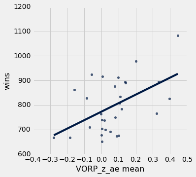

## Draft Adage \#2
### Big men who are too skinny as prospects are more likely to fail
---
A common knock against young big men entering the NBA is that they are too weak, too skinny, to compete with the grown men who dominate the league.

Here are a few excerpts of scouting reports on some of this year's big men:

- "Stronger players can bully him on the post on both ends of the floor … Has to bulk up to play at the next level, and appears to have a naturally skinny bodytype" - about Dragan Bender
- "Lacks muscle and weight for his position" - about Zhou Qi
- "Lacks lower body strength and not clear how much he can continue to fill out with his very narrow frame" - about YouTube mixtape phenom and aspiring NBA player Thon Maker

Clearly this is an attribute that teams take into serious consideration. How well did previous big men fare?


We created a histogram of the BMIs of NBA players at the time they were drafted. 


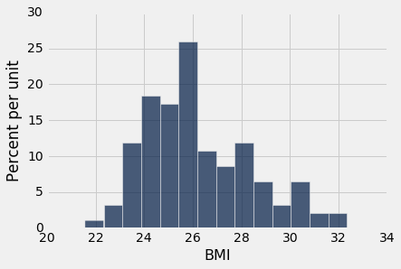
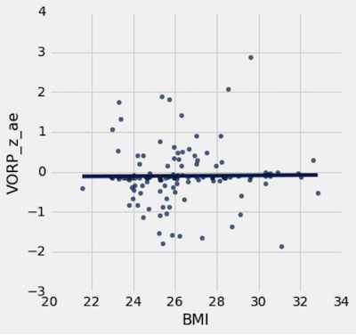


Then we simply plotted the `VORP_z_ae` against BMI. We can clearly see that there is no relationship between the two variables.

## Conclusion: Skinny big men did no worse than their bulkier counterparts
---
As we can see in this scatter plot, there is no correlation between a big man's BMI when entering the NBA and how their career pans out. This is good news for aspiring NBA players who are on the skinny side, such as Cal's very own Ivan Rabb (whenever he declares for the draft). 


It is however interesting to observe bigs with BMI < 26. There are more bigs with BMI < 26 who fell short of their expectations compared to bigs with BMI > 26. 


## Adage \#3
### Big men have shorter careers
---
Yao Ming might be one of the NBA's biggest "what if" players. Just as he became a dominant player, foot injuries derailed his career and forced an early retirement.  Around that time, the number 1 overall pick Greg Oden quickly fell out of the NBA after two major knee injuries. The media narrative developed that big men were more likely to have severe injury woes, especially in the feet. Is it true?


We used three metrics to define "career length." Years in the league provides a rough idea of how long a player's career was, but fails to account for the durability aspect we are testing in this adage. Therefore, we also took into account games played, which gives a more granular view of a player's career. Finally, we took into account minutes played, which gives the most granular view of the durability of a player, but lacks in accounting for a player like Yao Ming, who played lots of minutes early on in his career, but still had a career that most deem to be cut short by injury. The combination of these three metrics should do a good job of testing this adage. 

We proceeded by running a permutation test, with the null hypothesis that big men have the same career length as players of other positions.

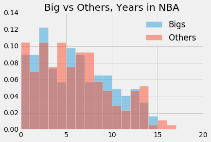


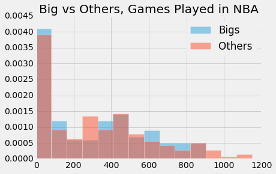


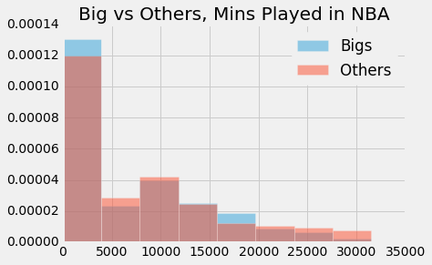


```python
def adage_3_test_statistic(bigs, others):
    return sum(bigs[:5] - others[:5]) + sum(others[10:] - bigs[10:])

combined = joined_bigs_table.append(joined_others_table)

def permutation_test(label):
    yrs = combined.pivot('Big', label)
    proportions = Table().with_columns([
            label, yrs.column(label),
            "Big", yrs.column('True')/sum(yrs.column('True')),
            "Other", yrs.column('False')/sum(yrs.column('False'))
        ])

    a = proportions.column('Big')
    b = proportions.column('Other')

    observed_statistic = adage_3_test_statistic(a, b)
    print('observed: ' + str(observed_statistic))


    repetitions = 500

    tvds = Table().with_column("Big minus Others: # of years in NBA", [])

    for i in np.arange(repetitions):
        # Construct a permuted table
        shuffled = combined.select(label).sample()
        # Construct a table in which career status has been shuffled
        players_with_shuffled_yrs = Table().with_columns([
            "Big", combined.column('Big'),
            label, combined.column(label),
            label + " (shuffled)", shuffled.column(label)
        ])

        yrs_shuffled = players_with_shuffled_yrs.pivot('Big', label + ' (shuffled)')

        # Compute TVD
        y_s = yrs_shuffled
        bigs = y_s.column('True')/sum(y_s.column('True'))
        others = y_s.column('False')/sum(y_s.column('False'))
        tvds.append([adage_3_test_statistic(bigs, others)])

    tvds.hist(bins=np.arange(-0.5, 0.5, 0.025))

    # tvds.show()

    empirical_p_value = np.count_nonzero(tvds.column(0) >= observed_statistic) / tvds.num_rows
    print('p-value: ' + str(empirical_p_value))

    
for label in ['Yrs', 'G', 'MP']:
    permutation_test(label)
```

    observed: -0.038982081586
    p-value: 0.688
    observed: -0.0273541746092
    p-value: 0.65
    observed: -0.0345024780785
    p-value: 0.71


## Conclusion: Big men have similar career lengths as non-big men!
---
It's very clear that our p-values are high. We fail to reject the null hypothesis.

The media narrative about big men having shorter careers was incorrect. It seems that there was selection bias which caused the narrative to develop. In reality, the numbers tell us that big men and non-big men have no difference in career lengths, in terms of years played, games played, and minutes played.

An area for improvement in the analysis of this adage is collecting injury data. Looking at the histograms, we see that a large number of players had very short careers. Most of these players exited the league not because of injury, but because they just were simply not good enough. This underlying source of noise may have altered the results. Unfortunately, we could not easily find a reliable source of player injury data, so we settled for the above analysis.
